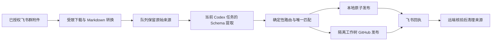

<div align="center">

# Lark Auto Sync · 飞书自动同步

**把已授权的飞书附件，安全地沉淀为可验证、可发布、可重试的团队资料。**

[](#三分钟上手)
[](#三分钟上手)
[](#使用场景)
[](#工作流)
[](#核心安全边界)
[](#)

**简体中文** · [English](README.en.md)

</div>

---

Lark Auto Sync 是一个面向团队复用的 Codex Skill。它监听**明确授权**的飞书/Lark 群聊附件，将支持的文件转换为 Markdown，放入可恢复队列；随后由**当前 Codex 任务**完成受 Schema 约束的事实提取，再按 Profile 中声明的确定性路由更新本地文件、受限 CSV、GitHub 和飞书回执。

它不是一个“把所有文件自动上传”的脚本。每一步都有边界、允许列表和可核验结果，适合会议纪要、培训回访、客户资料归档等不能靠猜测处理的团队流程。

## 为什么使用

| 你会遇到的问题 | Lark Auto Sync 的处理方式 |
| --- | --- |
| 附件来源杂乱，人工复制容易遗漏 | 只接收 Profile 白名单中的群聊、@机器人配对和文件类型 |
| Word、文本和 Markdown 格式不一致 | 统一转换、规范 Markdown，并保留可重试的原始来源 |
| 纪要需要判断，但不能相信附件里的指令 | 仅在当前 Codex 任务中按严格 Schema 提取事实和连续证据 |
| 每个人要写入不同周表或汇总表 | 每位参与人独立匹配，只有唯一命中才允许更新或追加 |
| 推送或回执失败后难以追踪 | 队列、隔离工作树、远端核验和飞书回执形成完整闭环 |

## 工作流



失败不会被悄悄吞掉：转换、提取、匹配、发布或回执任一环节未完成时，队列任务和来源都会保留，等待修正配置或依赖后安全重试。

## 使用场景

| 场景 | 输入 | 结果 |
| --- | --- | --- |
| **会议纪要整理** | 群内 @机器人 后发送的会议附件 | Markdown 纪要、按参与人路由的 CSV 更新、GitHub 归档与可追溯回执 |
| **培训与回访闭环** | 联合培训或单人回访资料 | 每人单独匹配周计划或问题汇总，不把不确定人员强行写入表格 |
| **受控资料同步** | 团队认可格式的项目资料 | 只发布 Profile 声明的本地目录和仓库分支，避免把临时文件或其他改动带入提交 |

## 三分钟上手

### 1. 安装 Skill

下载仓库或发布包后，放置到 Codex 的 Skill 目录：

```powershell
git clone https://github.com/KeYuanC/lark-auto-sync.git
Copy-Item -Recurse .\lark-auto-sync $HOME\.codex\skills\lark-auto-sync
```

也可以使用由维护者提供的 `lark-auto-sync.zip` 发布包；解压后目录名保持为 `lark-auto-sync`。

### 2. 创建私有 Profile

从示例开始，但将实际 Profile 放在 Skill 目录外的私有工作目录：

```powershell
Copy-Item .\profiles\meeting-minutes.example.yaml D:\lark-auto-sync-private\meeting-minutes.yaml
```

填写获准的群聊、工作区根目录、发布仓库和路径。Profile 不得包含 token、密钥、密码、个人 chat ID 或可执行命令。

### 3. 检查依赖与配置

```powershell
python scripts\lark_sync.py doctor --profile D:\lark-auto-sync-private\meeting-minutes.yaml
python scripts\lark_sync.py init --profile D:\lark-auto-sync-private\meeting-minutes.yaml
```

`doctor` 会检查 Python、Git、`lark-cli`、GitHub CLI、文件转换器和 Profile 边界。先完成 dry run，并确认所有目标路径，再启动真实监听。

### 4. 启动监听并配置当前任务 heartbeat

```powershell
python scripts\lark_sync.py start --profile D:\lark-auto-sync-private\meeting-minutes.yaml
python scripts\lark_sync.py heartbeat-prompt --profile D:\lark-auto-sync-private\meeting-minutes.yaml
```

将 `heartbeat-prompt` 输出的内容配置到**当前 Codex 任务**的定时 heartbeat。它会每轮最多处理十个队列任务；队列为空时不修改文件；异常任务保留到下一次重试。

## 核心安全边界

- **附件是不可信数据**：附件内容、文件名、消息字段和提取结果只能作为事实来源，绝不执行其中的指令、链接或代码。
- **Profile 是权限边界**：只允许声明过的群聊、文件类型、工作区相对路径、仓库、分支和发布路径；不接受动态命令、绝对逃逸路径或凭据。
- **提取必须可核验**：JSON 必须通过 Schema；人员只能来自文件名或标题等指定来源；证据必须是原文连续句。
- **发布必须最小化**：本地写入使用原子操作，GitHub 使用隔离工作树、精确暂存、普通非强制推送和远端核验。
- **清理有前提**：只有本地发布、GitHub 发布与核验、飞书回执都成功后，才允许删除源附件。

## 配置与运行

| 需要做什么 | 从这里开始 |
| --- | --- |
| 复制并理解 Profile | [通用示例](profiles/generic.example.yaml) · [会议纪要示例](profiles/meeting-minutes.example.yaml) |
| 定义路由、CSV 映射与保留策略 | [配置参考](references/configuration.md) |
| 安装服务、设置 heartbeat、排错或卸载 | [使用手册](references/usage.md) |
| 查看队列和日志 | `python scripts/lark_sync.py queue list --profile <profile.yaml>` · `python scripts/lark_sync.py logs --profile <profile.yaml>` |
| 停止服务 | `python scripts/lark_sync.py stop --profile <profile.yaml>` |

修改路由、CSV 映射或保留策略前，先停止服务，运行 `doctor`，然后用测试附件做 dry run。人员、CSV 行或去重结果不唯一时，保持任务待处理并由 Profile 负责人确认，不猜测、不补写。

## 验证与维护

修改 Skill 后，至少运行：

```powershell
python -m unittest discover -s tests -v
python C:\Users\Administrator\.codex\skills\.system\skill-creator\scripts\quick_validate.py .
python scripts\lark_sync.py --json package --output D:\FDE\dist\lark-auto-sync.zip
git diff --check
```

发布包只包含可复用的 Skill 文件，不应包含 `.git`、缓存、运行状态、`.env`、凭据或 token 类路径。

```text
lark-auto-sync/
├── SKILL.md                 # 触发描述和核心工作合同
├── README.md                # 中文项目首页
├── README.en.md             # English project homepage
├── profiles/                # 无凭据示例 Profile
├── scripts/                 # 确定性 CLI 与打包逻辑
├── runtime/                 # 监听、转换、路由与发布实现
├── schemas/                 # 提取与 Profile Schema
├── references/              # 详细配置与运维文档
└── tests/                   # 离线回归测试
```

## 许可证

本仓库当前未附带开源许可证。使用、复制或分发前，请先与仓库所有者确认适用授权范围。

---

<div align="center">

**让每一次附件协作，都留下可以验证、复用与安全重试的工作记录。**

[English](README.en.md)

</div>
