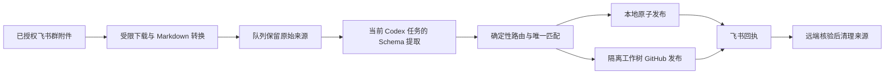

# Lark Auto Sync README Refresh Implementation Plan

> **For agentic workers:** REQUIRED SUB-SKILL: Use superpowers:subagent-driven-development (recommended) or superpowers:executing-plans to implement this plan task-by-task. Steps use checkbox (`- [ ]`) syntax for tracking.

**Goal:** Publish a bilingual GitHub project homepage that makes Lark Auto Sync understandable, trustworthy, and usable by colleagues.

**Architecture:** Keep the root README as the Chinese-first landing page and make `README.en.md` its complete English mirror. Use GitHub-native centered HTML, Shields.io badges, Mermaid, tables, and local links; keep detailed operational material in the existing reference documents. Package the same three README files in the credential-free ZIP.

**Tech Stack:** Markdown, GitHub Mermaid, Shields.io static badges, Python unittest, existing `scripts/lark_sync.py` package command.

## Global Constraints

- Use only GitHub-native Markdown/HTML and `flat-square` Shields.io badges.
- Do not use copied copy, artwork, or claims from `lov-team/akasha-grimoire`.
- Do not add credentials, chat IDs, tokens, external tracking, or user-specific Profiles.
- Preserve the existing `SKILL.md`, Profile examples, and detailed reference files.
- Keep all local links valid from the repository root and retain the ZIP credential/state exclusions.

---

### Task 1: Build the Bilingual Project Homepage

**Files:**
- Modify: `README.md`
- Modify: `README.en.md`
- Modify: `README.zh-CN.md`

**Interfaces:**
- Consumes: `references/usage.md`, `references/configuration.md`, `profiles/generic.example.yaml`, `profiles/meeting-minutes.example.yaml`.
- Produces: Chinese-first landing page, English mirror, and a compatibility Chinese redirect.

- [ ] **Step 1: Replace the root README with the Chinese-first landing page**

Use this opening structure, then add the specified sections in this exact order:

```markdown
<div align="center">

# Lark Auto Sync · 飞书自动同步

**把已授权的飞书附件，安全地沉淀为可验证、可发布、可重试的团队资料。**

[](#三分钟上手)
[](#使用场景)
[](#工作流)
[](#核心安全边界)
[](#核心安全边界)
[](#)

**简体中文** · [English](README.en.md)

</div>
```

Add `---` after the block. Add these headings: `为什么使用` (four concise benefits), `工作流` (the Mermaid diagram below), `使用场景` (three scenario cards as table rows), `三分钟上手` (four numbered setup steps and a command block), `核心安全边界` (five bullets), `配置与运行` (links to the existing references and examples), `验证与维护` (test/package commands and project tree), and `许可证` (state that no license is currently included rather than inventing one).



- [ ] **Step 2: Write the complete English mirror**

Use the same centered layout, six badges, Mermaid nodes, scenario table, quick
start commands, safety promises, reference links, verification commands, and
no-license statement in `README.en.md`. Use native English wording rather than
literal sentence-by-sentence translation. Include `[简体中文](README.md) · **English**`
in the centered language line and reciprocal links at the end.

- [ ] **Step 3: Turn the legacy Chinese file into a stable entry point**

Replace `README.zh-CN.md` with this complete content:

```markdown
# Lark Auto Sync · 飞书自动同步

[English](README.en.md) | [查看完整中文 README](README.md)

完整的中文项目说明、工作流、使用场景、安装步骤与安全边界已迁移至 [README.md](README.md)。
```

- [ ] **Step 4: Inspect local links and rendered structure**

Run:

```powershell
$root = 'C:\Users\Administrator\.codex\skills\lark-auto-sync'
rg -n '\]\((?!https?://|#)[^)]+\)' "$root\README*.md"
git -C $root diff --check
```

Expected: every repository-relative link resolves to an existing file; no whitespace errors.

- [ ] **Step 5: Commit the README rebuild**

```powershell
git -C C:\Users\Administrator\.codex\skills\lark-auto-sync add -- README.md README.en.md README.zh-CN.md
git -C C:\Users\Administrator\.codex\skills\lark-auto-sync commit -m "docs: 重构双语项目首页"
```

### Task 2: Verify Distribution And Publish

**Files:**
- Verify: `scripts/lark_sync.py`
- Verify: `tests/test_cli.py`
- Generate: `D:\FDE\dist\lark-auto-sync.zip`

**Interfaces:**
- Consumes: the existing `package` allowlist and `test_package_includes_bilingual_readmes` test.
- Produces: a GitHub-published README update and an archive containing all three README files without state or credential-like paths.

- [ ] **Step 1: Run the focused package test**

```powershell
Set-Location C:\Users\Administrator\.codex\skills\lark-auto-sync
python -m unittest discover -s tests -p test_cli.py -v
```

Expected: `OK` and the archive assertion finds `README.md`, `README.zh-CN.md`, and `README.en.md`.

- [ ] **Step 2: Run full validation and rebuild the archive**

```powershell
Set-Location C:\Users\Administrator\.codex\skills\lark-auto-sync
python -m unittest discover -s tests -v
python C:\Users\Administrator\.codex\skills\.system\skill-creator\scripts\quick_validate.py .
python scripts\lark_sync.py --json package --output D:\FDE\dist\lark-auto-sync.zip
```

Expected: all tests pass, `Skill is valid!`, and package JSON has `"status": "created"`.

- [ ] **Step 3: Audit the generated archive**

```powershell
@'
import zipfile
from pathlib import Path
with zipfile.ZipFile(Path(r'D:\FDE\dist\lark-auto-sync.zip')) as zf:
    names = zf.namelist()
required = {
    'lark-auto-sync/README.md',
    'lark-auto-sync/README.zh-CN.md',
    'lark-auto-sync/README.en.md',
}
forbidden = [name for name in names if any(token in name.lower() for token in (
    '.git/', '__pycache__/', '.automation-state/', '.env', 'credential', 'token',
))]
assert required <= set(names), required - set(names)
assert not forbidden, forbidden
print(f'entries={len(names)}')
'@ | python -
```

Expected: a positive entry count and no assertion failure.

- [ ] **Step 4: Push the verified commits normally**

```powershell
git -C C:\Users\Administrator\.codex\skills\lark-auto-sync status -sb
git -C C:\Users\Administrator\.codex\skills\lark-auto-sync push origin master
```

Expected: clean tracking status and a normal non-force push to `origin/master`.
